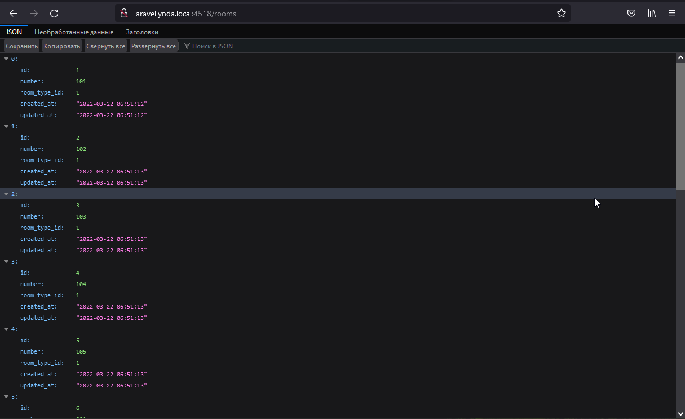

http://laravellynda.local:4518/rooms  

1. Работает routes/web.php и отправляет в контроллер ShowRoomsController
2. ShowRoomsController в методе __invoke выводит на экран все комнаты из БД в формате JSON

