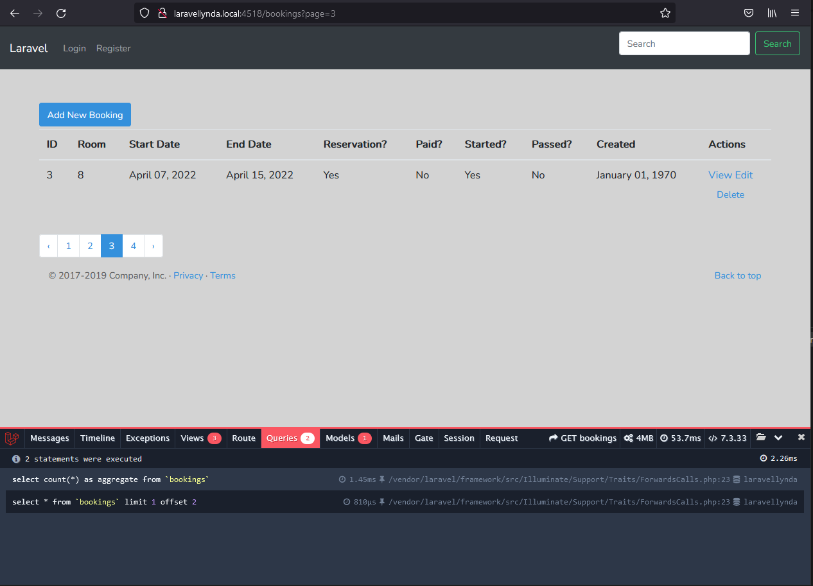

## 27. Pagination

http://laravellynda.local:4518/bookings?page=3

Пагинация продумана и выполняется самостоятельно с помощью добавления двух моментов:  

1. 

В методе BookingController@index используется строчка пагинации

    $bookings = Booking::paginate(1);

вместо строчки, получающей все записи из БД

    $bookings = DB::table('bookings')->get();

2.

Добавление ссылок пагинации во вью bookings\index.blade.php:

    {{ $bookings->links() }}

